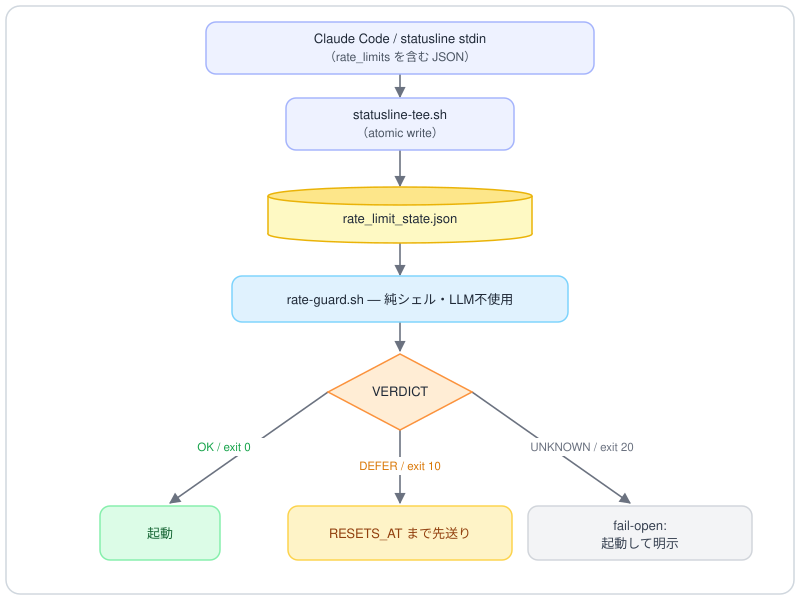

# claude-rate-guard

*[English](./README.md) | 日本語*

**Claude Code の長時間ワークフローを、5時間の利用枠切れから守るツールです。**

`rate-guard.sh` は、長時間のワークフローを起動・継続してよいかを判定する小さなシェルスクリプトです（LLM を使わず、トークンも消費しません）。Claude Code がステータス行（statusline）に渡す利用状況を読み取り、設定したしきい値と比べて、`OK`・`DEFER`・`UNKNOWN` のいずれかを返します。

このツールは判断材料を返すだけで、動作を止めることはしません。実際にどうするかは、呼び出す側のエージェント（またはスクリプト）が決めます。常駐プログラムはなく、外部に送るデータもありません。

---

## 解決する問題

長時間のワークフローは数十分かかることがあります。途中で **5時間の利用上限** を超えると、走行中のサブエージェントの呼び出しが失敗し始めます。多くの構成ではこの失敗が握りつぶされ、はっきりしたエラーの代わりに **途中で打ち切られた結果** を黙って返します。出力を読むまで気づけません。

`claude-rate-guard` を使うと、長時間の処理を始める**前**（pre-flight）と、**走行中に一定間隔で**（mid-run watchdog）、残りの枠を確認できます。打ち切られる前に先送りや一時停止ができ、枠がリセットされた後に再開できます。

---

## 仕組み

<!-- Mermaid 非対応環境（GitHub モバイルアプリ等）でも描画されるよう SVG にしています。図のソース: docs/assets/architecture.ja.mmd -->


1. **`statusline-tee.sh`** を、いま使っている `statusLine.command` に追記します。ステータス行が描画されるたびに、入力から利用率とリセット時刻（epoch）を読み取り、小さな state ファイルにまとめて書き込みます（書き込みは一括で行い、途中の状態を読まれないようにします）。
2. **`rate-guard.sh`** がその state ファイルを読み、`five_hour.used_percentage` をしきい値（既定 **80%**）と比べます。
3. `KEY=VALUE` 形式で結果を出力し、`0`（OK）/ `10`（DEFER）/ `20`（UNKNOWN）で終了します。

`rate_limits` を Claude Code が渡してくれるのはステータス行だけなので、いったんファイルに控える（tee）手順が必要です。`rate-guard.sh` 自体は API を一切呼びません。

---

## 必要なもの

- `statusLine.command` を設定できる **Claude Code**。
- **Claude.ai Pro/Max プラン**。`rate_limits` はこれらのプランでのみステータス行に渡されます。無い場合は `UNKNOWN`（fail-open）を返します。
- **`jq` / `awk` / `date`**（GNU・BSD どちらの `date` でも動きます）。
- **毎ターンの現在時刻**（`DEFER`／再開フロー（FR-07/08）を使う場合に推奨。必須ではありません）。ゲートが `SECONDS_TO_RESET`（リセットまでの残り秒）を出力するので、エージェントは自分の時計が無くても、この値だけで再開を予約できます。現在時刻の取得（例：`UserPromptSubmit` フック）は、自分の言葉で実時刻を伝える場合や妥当性確認には有用ですが、予約自体には不要です。

---

## インストール

1. `rate-guard.sh` を安定した場所（例：`~/.claude/scripts/rate-guard.sh`）に置き、`chmod +x` を実行します。
2. **`statusline-tee.sh`** の本体を、`statusLine.command` が指すスクリプトに追記します。ステータス行がまだ `rate_limits` を読み取っていない場合は、`statusline-tee.sh` の冒頭にある読み取り行のコメントを外します。
3. ステータス行の描画を1回起こします（何か操作すれば描画されます）。state ファイルができたことを確認します：

   ```sh
   cat ~/.claude/rate_limit_state.json
   bash ~/.claude/scripts/rate-guard.sh
   ```

---

## アンインストール

`claude-rate-guard` が追加するのは、`~/.claude` 配下のファイルと（任意で）`statusLine.command` の設定だけです。元に戻すのは簡単で、他には何も触りません：

1. **ステータス行の設定を戻す。** `~/.claude/settings.json` で、以前の `statusLine.command` に戻すか、`statusLine` の項目を削除します。既存のステータス行スクリプトに tee のブロックを追記しただけなら、そのブロックだけ削除し、スクリプトは残します。
2. **入れたスクリプトを削除する。** 例：`rm -f ~/.claude/scripts/rate-guard.sh`（`~/.claude/statusline-command.sh` は、このツールが作成した場合のみ削除）。
3. **動作中の状態とログを削除する。** `rm -f ~/.claude/rate_limit_state.json ~/.claude/rate-guard.tee.log`
4. プロジェクトの `CLAUDE.md` に運用ルールを貼っていれば、その部分を削除します。

このツールは常駐プログラムを動かさず、`~/.claude` の外には何も書かず、ネットワークにも何も送りません。そのため、他に片づけるものはありません。

---

## 出力の仕様

`rate-guard.sh` は `KEY=VALUE` 形式の行を標準出力に出し、終了コードを設定します：

| VERDICT   | exit | 意味 |
|-----------|------|------|
| `OK`      | `0`  | 利用率がしきい値未満。起動・継続して問題ない |
| `DEFER`   | `10` | 利用率がしきい値以上。起動**しない**でリセットを待つ |
| `UNKNOWN` | `20` | state が無い・古い・不完全。**fail-open**（起動するが、残量が不明であることを伝える） |

出力するキー：`VERDICT` / `FIVE_HOUR_PCT` / `HEADROOM_PCT` / `RESETS_AT`（epoch）/ `RESETS_AT_HUMAN` / `SECONDS_TO_RESET` / `REASON`。`SECONDS_TO_RESET` はリセットまでの残り秒で、ゲートが `RESETS_AT − now` で算出します。エージェントは自分の現在時刻を知らなくても、この値で再開を予約できます（リセット時刻が不明なら空、すでに過ぎていれば負値）。`HEADROOM_PCT` はしきい値までの余裕（`しきい値 − 使用率`、負なら 0。`UNKNOWN` では空）で、大きな起動の前に推定消費と突き合わせます。数値は浮動小数の誤差（`14.000000000000002` 等）だけを除いた形で出力し、実質の精度は保ちます（前後差分の計測が可能）。判定は生値で行います。

```sh
$ rate-guard.sh
VERDICT=OK
FIVE_HOUR_PCT=37
HEADROOM_PCT=43
RESETS_AT=1782200400
RESETS_AT_HUMAN=06/23 16:40
SECONDS_TO_RESET=4853
REASON=5h usage 37% < threshold 80%
```

---

## 設定（環境変数）

| 変数 | 既定 | 用途 |
|---|---|---|
| `RATE_GUARD_THRESHOLD` | `80` | この5時間利用率以上で DEFER にする。適切な範囲は `[10,95]`。 |
| `RATE_GUARD_STALE_SECONDS` | `900` | state がこれより古ければ `UNKNOWN` を返す。 |
| `RATE_GUARD_STATE_FILE` | `~/.claude/rate_limit_state.json` | tee が書き込み、ガードが読み取る場所。 |

---

## エージェントでの使い方

3つの使い方があります（[`examples/`](./examples) を参照）：

- **Pre-flight（予算比較つき）**：長時間ワークフローを起動する前にガードを実行します。大きな起動では `OK` だけでは足りず、推定消費（×安全係数 1.3）が `HEADROOM_PCT` に収まることも確認します。`DEFER` なら起動せず、`RESETS_AT` の直後に再試行を予約します。`UNKNOWN` なら起動しますが、残量が不明であることを伝えます。
- **バッチ分割**（大規模フリートの第一防衛線）：最初の小さなバッチでユニットあたりの消費を実測し、余裕に収まる大きさにバッチを切り、バッチ境界ごとにガードを再実行し、バッチごとに成果を確定します。止まるのは常に境界で、走行中の損失が起きません。
- **Mid-run watchdog**（保険）：1つの枠を超えそうな単発処理向けです。バックグラウンドで起動し、`(100 − しきい値) ÷ 最大バーンレート` を超えない間隔でガードを実行します。`DEFER` になったら区切りのよい所で止め、リセット後の再開を予約します。

[`examples/CLAUDE.md.snippet`](./examples/CLAUDE.md.snippet) は、プロジェクトの `CLAUDE.md` にそのまま貼れる運用ルールのひな形です。

---

## 制約

- **検出のみで、強制はしません。** ワークフローを自動で止める仕組みはなく、エージェントがガードを呼ぶ必要があります（`PreToolUse` で強制的に止める方法は、すべてのワークフローに一律で効いてしまうため、あえて対象外にしています）。
- **新しさはステータス行の描画頻度に依存します。** 描画の合間は state が古くなることがあります。`RATE_GUARD_STALE_SECONDS` が、古いデータでの判断を防ぎます。
- **Pro/Max のみ。** 他のプランでは `rate_limits` が無く、`UNKNOWN` になります。
- 判定は読み取った時点の状態を表します。`DEFER` は「まもなく止める」という意味で、正確な停止位置ではありません。読み取りだけのワークフローはいつ止めても問題ありませんが、書き込みなどを伴うものは、同じ操作を繰り返しても結果が変わらないように作ってください。
- **しきい値だけでは高並列フリートを守れません。** 毎分数ポイントを消費する走行は、`OK` の数分後に枠を使い切ることがあります。推定消費を `HEADROOM_PCT` と突き合わせ、大きな仕事はバッチに分割してください（仕様の FR-06/FR-09 を参照）。

---

## ドキュメント

要件定義の全文です（pre-flight と mid-run watchdog の動作ルール、付録を含みます）：

- [`docs/SPEC.md`](./docs/SPEC.md) — 英語
- [`docs/SPEC.ja.md`](./docs/SPEC.ja.md) — 日本語（原典）

## ライセンス

[MIT](./LICENSE) © 2026 [otoph](https://x.com/otophotoph)
