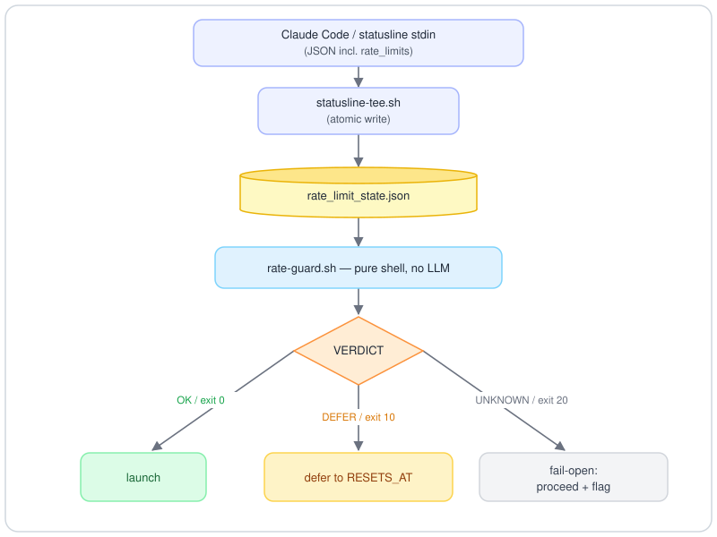

# claude-rate-guard

*English | [日本語](./README.ja.md)*

**Guard long-running Claude Code workflows against the 5-hour rate-limit window.**

`rate-guard.sh` is a small, pure-shell check (no LLM, zero tokens) that decides
whether there is enough of the **5-hour usage window** left to start, or keep
running, a long workflow. It reads the usage figures Claude Code passes to the
status line, compares them against a threshold, and returns one verdict: `OK`,
`DEFER`, or `UNKNOWN`.

The tool is advisory: it only reports a verdict and never stops anything. Your
agent (or a wrapper script) calls it and decides what to do. There is no
enforcement hook, no background process, and nothing is sent anywhere.

---

## The problem it solves

A long workflow can run for tens of minutes. If it crosses the **5-hour usage
limit** while running, its subagent calls start to fail. In many setups those
failures are swallowed, so the run returns **truncated or degraded** results
instead of a clear error, and you only notice when you read the output.

`claude-rate-guard` lets the agent check the remaining window **before** starting
a long run (pre-flight) and **at intervals while it runs** (mid-run watchdog). It
can then defer or checkpoint before being cut off, and resume after the window
resets.

---

## How it works

<!-- Rendered as SVG so it shows everywhere (incl. the GitHub mobile app, which does not render Mermaid). Diagram source: docs/assets/architecture.mmd -->


1. **`statusline-tee.sh`** is appended to your existing `statusLine.command`. On
   each status-line render, it reads the usage percentages and reset times from
   the status-line input and writes them to a small state file with an atomic
   write.
2. **`rate-guard.sh`** reads that state file and compares
   `five_hour.used_percentage` against a threshold (default **80%**).
3. It prints `KEY=VALUE` lines and exits `0` (OK) / `10` (DEFER) / `20` (UNKNOWN).

The status line is the only place Claude Code exposes `rate_limits`, so the tee
step is required. `rate-guard.sh` itself never calls any API.

---

## Requirements

- **Claude Code** with a configurable `statusLine.command`.
- A **Claude.ai Pro/Max subscription**. `rate_limits` is passed to the status
  line only on these plans. Without it, the guard returns `UNKNOWN` (fail-open).
- **`jq`, `awk`, `date`** (both GNU and BSD `date` are handled).
- **The current time, each turn** — recommended for the `DEFER`/resume flow
  (FR-07/08), but no longer required. The gate prints `SECONDS_TO_RESET` (the wait
  until the reset), so an agent can schedule a resume from that alone, without its
  own clock. Injecting the current time (for example through a `UserPromptSubmit`
  hook) is still useful for stating wall-clock times in your own words and as a
  sanity check, but it is not needed to schedule.

---

## Install

1. Put `rate-guard.sh` in a stable location, for example
   `~/.claude/scripts/rate-guard.sh`, and run `chmod +x` on it.
2. Append the body of **`statusline-tee.sh`** to the script that your
   `statusLine.command` points to. If your status line does not already read
   `rate_limits`, uncomment the extraction lines at the top of
   `statusline-tee.sh`.
3. Trigger one status-line render (any interaction). Confirm the state file
   appears:

   ```sh
   cat ~/.claude/rate_limit_state.json
   bash ~/.claude/scripts/rate-guard.sh
   ```

---

## Uninstall

`claude-rate-guard` only adds files under `~/.claude` and, optionally, a
`statusLine.command` entry. Removal is fully reversible and touches nothing else:

1. **Unwire the status line.** In `~/.claude/settings.json`, restore your previous
   `statusLine.command` or remove the `statusLine` block. If you only appended the
   tee block to an existing status-line script, delete that block and keep the
   script.
2. **Remove the scripts** you installed, for example
   `rm -f ~/.claude/scripts/rate-guard.sh` (and `~/.claude/statusline-command.sh`
   only if this tool created it).
3. **Remove the runtime state and log:**
   `rm -f ~/.claude/rate_limit_state.json ~/.claude/rate-guard.tee.log`
4. If you pasted the operating contract into a project `CLAUDE.md`, delete that
   section.

The guard runs no background process, writes nothing outside `~/.claude`, and
sends nothing over the network, so there is nothing else to clean up.

---

## Output contract

`rate-guard.sh` prints `KEY=VALUE` lines to stdout and sets an exit code:

| VERDICT   | exit | meaning |
|-----------|------|---------|
| `OK`      | `0`  | usage is below the threshold; safe to start or continue |
| `DEFER`   | `10` | usage is at or above the threshold; do **not** start, wait for the reset |
| `UNKNOWN` | `20` | state is missing, stale, or incomplete; **fail-open**: proceed, but flag that the remaining budget is unknown |

Keys printed: `VERDICT`, `FIVE_HOUR_PCT`, `HEADROOM_PCT`, `RESETS_AT` (epoch),
`RESETS_AT_HUMAN`, `SECONDS_TO_RESET`, `REASON`. `SECONDS_TO_RESET` is the wait
until the reset, computed by the gate (`RESETS_AT - now`), so an agent can
schedule a resume from it without knowing the current time (empty if the reset
time is unknown, negative if it has already passed). `HEADROOM_PCT` is the room
left up to the threshold (`threshold - usage`, floored at 0; empty on
`UNKNOWN`) — compare your estimated consumption against it before a large
launch. Percentages are rounded to one decimal for display; the verdict is
computed on the raw value.

```sh
$ rate-guard.sh
VERDICT=OK
FIVE_HOUR_PCT=37
HEADROOM_PCT=43
RESETS_AT=1782200400
RESETS_AT_HUMAN=06/23 16:40
SECONDS_TO_RESET=4853
REASON=5h usage 37% < threshold 80%
```

---

## Configuration (environment variables)

| Variable | Default | Purpose |
|---|---|---|
| `RATE_GUARD_THRESHOLD` | `80` | DEFER at or above this 5-hour usage percentage. Sensible range `[10,95]`. |
| `RATE_GUARD_STALE_SECONDS` | `900` | If the state file is older than this, return `UNKNOWN`. |
| `RATE_GUARD_STATE_FILE` | `~/.claude/rate_limit_state.json` | Where the tee writes and the guard reads. |

---

## Using it with an agent

Three patterns (see [`examples/`](./examples)):

- **Pre-flight with budget sizing**: before starting a long workflow, run the
  guard. `OK` alone is not enough for a large launch — also check that the
  estimated consumption (× 1.3 safety factor) fits `HEADROOM_PCT`. `DEFER`
  skips the run and schedules a retry just after `RESETS_AT`; `UNKNOWN`
  proceeds but states that the remaining budget is unknown.
- **Batch splitting** (the first line of defense for large fleets): measure the
  cost per unit with a small first batch, size batches to fit the headroom,
  re-run the guard at each batch boundary, and commit results per batch. The
  run then stops at boundaries, never mid-flight.
- **Mid-run watchdog** (insurance): for a single run that may exceed one
  window, start it in the background, then run the guard at an interval below
  `(100 − threshold) ÷ max burn rate`. On `DEFER`, stop at a checkpoint and
  schedule a resume after the reset.

[`examples/CLAUDE.md.snippet`](./examples/CLAUDE.md.snippet) is an operating
contract you can paste into your project's `CLAUDE.md`.

---

## Limitations

- **Advisory, not enforced.** Nothing stops a workflow automatically; the agent
  has to call the guard. (A `PreToolUse` enforcement hook is deliberately out of
  scope, because it would act on every workflow.)
- **Freshness depends on how often the status line renders.** Between renders the
  state can be stale; `RATE_GUARD_STALE_SECONDS` prevents acting on old data.
- **Pro/Max only.** On other plans `rate_limits` is absent, so the verdict is
  `UNKNOWN`.
- The verdict reflects the moment it was read. Treat `DEFER` as "stop soon", not
  an exact stop point. Read-only workflows are safe to stop; side-effecting ones
  should be idempotent.
- **A threshold alone cannot protect a highly parallel fleet.** A run burning
  several points per minute can exhaust the window minutes after an `OK`.
  Compare the estimated consumption against `HEADROOM_PCT` and split large work
  into batches (see the spec, FR-06/FR-09).

---

## Docs

The full requirements/spec, including the pre-flight and mid-run-watchdog
behavioral contracts and appendices:

- [`docs/SPEC.md`](./docs/SPEC.md) — English
- [`docs/SPEC.ja.md`](./docs/SPEC.ja.md) — 日本語（原典）

## License

[MIT](./LICENSE) © 2026 [otoph](https://x.com/otophotoph)
