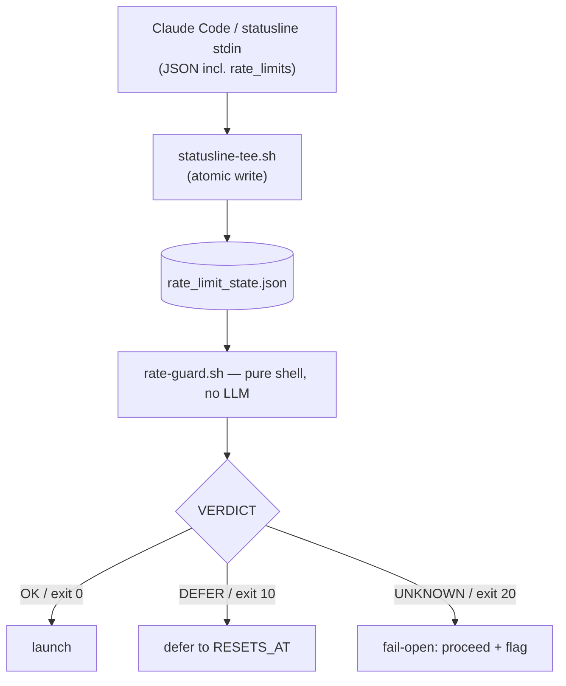

# claude-rate-guard

**Guard long-running Claude Code workflows against the 5-hour rate-limit window.**

`rate-guard.sh` is a tiny, pure-shell check (no LLM, zero tokens) that tells your
Claude Code agent whether there is enough of the **5-hour usage window** left to
safely *launch* — or keep *running* — a long multi-agent workflow. It reads the
authoritative usage figures that Claude Code exposes to the status line, compares
them against a threshold, and prints a single verdict: `OK`, `DEFER`, or `UNKNOWN`.

It is **advisory**: your agent (or a wrapper script) calls it and decides what to
do. There is no enforcement hook, no daemon, and nothing is sent anywhere.

---

## The problem it solves

A long multi-agent workflow can run for tens of minutes. If it crosses the
**5-hour usage limit** mid-flight, in-flight subagent calls start failing — and in
many orchestration setups those failures are *swallowed*, so the run silently
returns **truncated / degraded** results instead of erroring loudly. You don't
notice until you read the output.

`claude-rate-guard` lets the agent check the remaining window **before** launching
a long run (pre-flight), and **periodically while it runs** (mid-run watchdog), so
it can defer or checkpoint *before* getting cut off — then resume after the window
resets.

---

## How it works



1. **`statusline-tee.sh`** is appended to your existing `statusLine.command`. On
   every status-line render it extracts the usage percentages / reset epochs from
   the status-line input JSON and writes them atomically to a small state file.
2. **`rate-guard.sh`** reads that state file and compares
   `five_hour.used_percentage` against a threshold (default **80%**).
3. It prints `KEY=VALUE` lines and exits `0` (OK) / `10` (DEFER) / `20` (UNKNOWN).

The status line is the only place Claude Code surfaces `rate_limits`, which is why
the tee step is required — `rate-guard.sh` itself never calls any API.

---

## Requirements

- **Claude Code** with a configurable `statusLine.command`.
- A **Claude.ai Pro/Max subscription** — `rate_limits` is surfaced to the status
  line only on these plans. Without it the guard returns `UNKNOWN` (fail-open).
- **`jq`, `awk`, `date`** (GNU or BSD `date` both handled).
- For acting on `DEFER` (scheduling a resume), your agent needs **the current
  time each turn** (e.g. inject it via a `UserPromptSubmit` hook), since the
  reset time is an epoch in the state file.

---

## Install

1. Put `rate-guard.sh` somewhere stable, e.g. `~/.claude/scripts/rate-guard.sh`,
   and `chmod +x` it.
2. Append the body of **`statusline-tee.sh`** to the script referenced by your
   `statusLine.command`. If your status line doesn't already extract
   `rate_limits`, uncomment the extraction lines at the top of `statusline-tee.sh`.
3. Trigger one status-line render (any interaction). Confirm the state file
   appears:

   ```sh
   cat ~/.claude/rate_limit_state.json
   bash ~/.claude/scripts/rate-guard.sh
   ```

---

## Uninstall

`claude-rate-guard` only adds files under `~/.claude` and (optionally) a
`statusLine.command` entry. Removal is fully reversible and touches nothing else:

1. **Unwire the status line.** In `~/.claude/settings.json`, restore your previous
   `statusLine.command` or remove the `statusLine` block. If you only *appended* the
   tee block to an existing status-line script, delete just that block and keep the
   script.
2. **Remove the scripts** you installed, e.g.
   `rm -f ~/.claude/scripts/rate-guard.sh` (and `~/.claude/statusline-command.sh`
   only if this tool created it).
3. **Remove the runtime state and log:**
   `rm -f ~/.claude/rate_limit_state.json ~/.claude/rate-guard.tee.log`
4. If you pasted the operating contract into a project `CLAUDE.md`, delete that
   section.

The guard runs no daemon, writes nowhere outside `~/.claude`, and sends nothing
over the network — so there is nothing else to clean up.

---

## Output contract

`rate-guard.sh` prints `KEY=VALUE` lines to stdout and sets an exit code:

| VERDICT   | exit | meaning |
|-----------|------|---------|
| `OK`      | `0`  | usage is below threshold — safe to launch / continue |
| `DEFER`   | `10` | usage is at/above threshold — do **not** launch; wait for reset |
| `UNKNOWN` | `20` | state missing/stale/incomplete — **fail-open**; proceed but flag that remaining budget is unknown |

Keys emitted: `VERDICT`, `FIVE_HOUR_PCT`, `RESETS_AT` (epoch), `RESETS_AT_HUMAN`,
`REASON`.

```sh
$ rate-guard.sh
VERDICT=OK
FIVE_HOUR_PCT=37
RESETS_AT=1782200400
RESETS_AT_HUMAN=06/23 16:40
REASON=5h usage 37% < threshold 80%
```

---

## Configuration (environment variables)

| Variable | Default | Purpose |
|---|---|---|
| `RATE_GUARD_THRESHOLD` | `80` | DEFER at/above this 5-hour usage %. Sane range `[10,95]`. |
| `RATE_GUARD_STALE_SECONDS` | `900` | If the state file is older than this, return `UNKNOWN`. |
| `RATE_GUARD_STATE_FILE` | `~/.claude/rate_limit_state.json` | Where the tee writes / the guard reads. |

---

## Using it with an agent

Two patterns (see [`examples/`](./examples)):

- **Pre-flight** — before launching a long workflow, run the guard. `OK` → launch;
  `DEFER` → don't launch, schedule a retry just after `RESETS_AT`; `UNKNOWN` →
  proceed but say remaining budget is unknown.
- **Mid-run watchdog** — for a run that may exceed one window, launch it in the
  background, then on a coarse interval run the guard; on `DEFER`, stop at a
  checkpoint and reschedule a resume after reset.

[`examples/CLAUDE.md.snippet`](./examples/CLAUDE.md.snippet) is a drop-in
operating contract you can paste into your project's `CLAUDE.md`.

---

## Limitations

- **Advisory, not enforced.** Nothing blocks a workflow automatically; the agent
  must call the guard. (A `PreToolUse` enforcement hook is intentionally out of
  scope — it would act on every workflow indiscriminately.)
- **Freshness depends on status-line render cadence.** Between renders the state
  can be stale; `RATE_GUARD_STALE_SECONDS` guards against acting on old data.
- **Pro/Max only.** On other plans `rate_limits` is absent → `UNKNOWN`.
- Verdict reflects the moment it was read; treat `DEFER` as "stop soon", not an
  exact stop position. Read-only workflows are harmless to stop; side-effecting
  ones should be idempotent.

---

## Docs

The full requirements/spec — including the pre-flight and mid-run-watchdog
behavioral contracts and appendices:

- [`docs/SPEC.md`](./docs/SPEC.md) — English
- [`docs/SPEC.ja.md`](./docs/SPEC.ja.md) — 日本語（原典）

## License

[MIT](./LICENSE) © 2026 otoph
